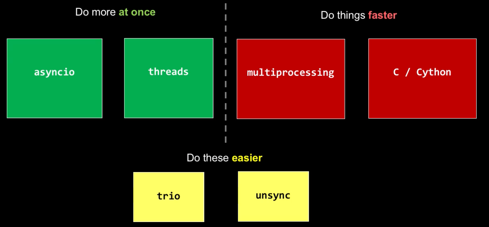
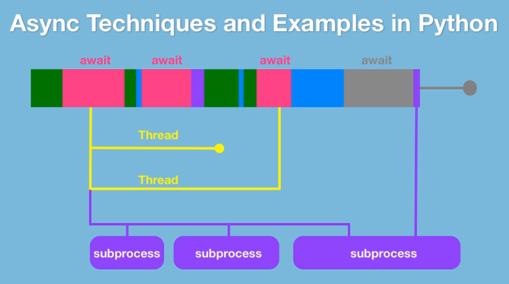

This project is to demonstrate how Python works for concurrency. The version of Python is expected to be 3.5 or above.

- [Overview](#overview)
- [AsyncIO](#asyncio)
  - [Anatomy](#anatomy)
- [Thread](#thread)
  - [Anatomy](#anatomy-1)
  - [Lock](#lock)
- [Thread vs AsyncIO](#thread-vs-asyncio)
- [Multiprocessing](#multiprocessing)
- [Third-Party Library](#third-party-library)
- [Cython](#cython)
- [Reference](#reference)

## Overview





Python has a memory management feature called the __GIL__, or __Global Interpreter Lock__.

1. why async and when
2. async and await (asyncio)
3. multi-threaded parallelism
4. thread safety
5. multi-process parallelism
6. execution pools
7. extending async patterns
8. async web frameworks
9. parallelism in C (with Cython)


## AsyncIO

Cooperative Concurrency or Parallelism.

> Asynchrony, in computer programming, refers to the occurrence of events independent of the main program flow and ways to deal with such events.
>
> These may be "outside" events such as the arrival of signals, or actions instigated by a program that take place concurrently with program execution, without the program blocking to wait for results.

### Anatomy
Asynchronous method:
- Begin by making method `async`
- `await` all async methods called

```py
async def process_data(num: int, data: asyncio.Queue):
  processed = 0

  while processed < num:
    item = await data.get()
    # further process with item when acquired
    ...

  return
```

Async web request:
- Use an `async with` block to start the request
- `await` the network read operation

```py
async def get_html(url: str):
  async with aiohttp.ClientSession() as session:
    async with session.get(url) as resp:
      resp.raise_for_status()

      return await resp.text()
```


## Thread

### Anatomy

```py
def generate_data(num: int, inputs: list):
  ...

# create the thread, set thread executing at the background by setting daemon to True
work = threading.Thread(
  target=generate_data,
  args=(20,[]),
  daemon=True
)

# start the thread
work.start()

...

# ask the thread to join into current main thread, so that main thread will wait until the tread is finished
work.join()

# anything else will only continue after thread above is done
...

```

### Lock
There are multiple cases that would cause unexpected situations:
- no lock: data inconsistency
- multiple threads share two locks:
  - when one thread holds one and the other holds another, starvation would occur since each thread won't release the lock
  - when locks doesn't have an order to acquire, starvation would occur since each thread may keep acquire and release the same lock


## Thread vs AsyncIO
Thread and AsyncIO are both for "do more at once" while waiting on other things to be finished.

AsyncIO programming model is actually nicer and cleaner, which is basically the synchronous regular programming model with just understanding restartable coroutines.

Threaded programming, though old school, is still needed since no all libraries and systems is fittable with `async` and `await`. When speaking about the GIL, it means threads are no good for concurrency when trying to leverage CPU bound operations, since GIL will only allow the code to execute one operation at a time. One of the important caveats around that is Python will let go of GIL while it's waiting on IO operations like go over the network or talk to the file system.

All in all, AsyncIO when you can, Thread when you must.


## Multiprocessing

```py
# create a new Pool instance
pool = Pool(processes=3)

# start the work with `apply_async`
pool.apply_async(func=do_math, args({arg1}, {arg2}))
pool.apply_async(func=do_math, args({arg1}, {arg2}))
pool.apply_async(func=do_math, args({arg1}, {arg2}))

# must call `close` then `join`
pool.close()
pool.join()
```


## Third-Party Library
The reasons for the need of additional libraries:
- Executing an asynchronous function __outside of an existing event__ loop is troublesome
- `asyncio.Future` is not thread safe
- `concurrent.Future` cannot be directly awaited
- `Future.result()` is a blocking operation even within an event loop
- `asyncio.Future.result()` will throw an exception if the future is not done
- Asynchronous functions __always execute in the `asyncio` loop__ (not thread or process backed)
- Cancellation and timeouts are tricky in threads and processes
- Thread local storage doesn't work for `asyncio`concurrency
- Testing concurrent code can be very tricky

Mixed mode parallelism with `unsync`:
```py
tasks = [
  compute_some(),       # multiprocess
  download_some_more(), # asyncio
  download_some(),      # thread
  wait_some(),          # asyncio
]

[t.result() for t in tasks]

@unsync(cpu_bound=True)
def compute_some():
  pass

@unsync()
def download_some():
  pass

@unsync()
async def download_some_more():
  pass
```


## Cython
Cython is an optimizing static compiler for the Python programming language. It makes writing C extensions for Python as easy as Python itself.

Advantages:
- Write Python code that calls back and forth from and to C or C++ code natively at any point
- Easily tune readable Python code into plain C performance by adding static tpe declarations
- Use combined source code level debugging to find bugs in your Python, Cython and C code
- Interact efficiently with large data sets, e.g. using multi-dimensional Numpy arrays
- Quickly build applications within the large, mature and widely used CPython ecosystem
- Integrate natively with existing code and data from legacy, low-level or high-performance libraries and applications

Pure Python:
```py
import math

def do_math(start: int, num: int):
  dist = 0.0
  pos = start
  k_sq = 1_000 * 1_000

  while pos < num:
    pos += 1
    dist = math.sqrt((pos - k_sq) * (pos - k_sq))

  return
```

Converted Cython:
```py
from libc.math cimport sqrt

def do_math(start: cython.int, num: cython.int):
  dist: cython.float =0.0
  pos: cython.float = start
  k_sq: cython.float = 1_000 * 1_000

  while pos < num:
    pos += 1
    dist = math.sqrt((pos - k_sq) * (pos - k_sq))

  return
```

Running Cython:
1. Write Cython code, ".pyx"
2. Create a "setup.py"
3. Compile the Cython code using "setup.py" via `python setup.py build_ext --inplace`.

The corresponding ".so" compiled file should be created.


## Reference
- Async Techniques and Examples in Python: https://training.talkpython.fm/courses/details/async-in-python-with-threading-and-multiprocessing
- Power and Head Problems Led to Multiple Cores and Prevent Further Improvements in Speed: https://www.slideshare.net/Funk98/end-of-moores-law-or-a-change-to-something-else
- Sample Code: https://github.com/talkpython/async-techniques-python-course
- Unsynchronize asyncio: https://github.com/alex-sherman/unsync
- A friendly Python library for async concurrency and I/O: https://github.com/python-trio/trio
- Quart:https://gitlab.com/pgjones/quart/
- wrk - a HTTP benchmarking tool: https://github.com/wg/wrk
