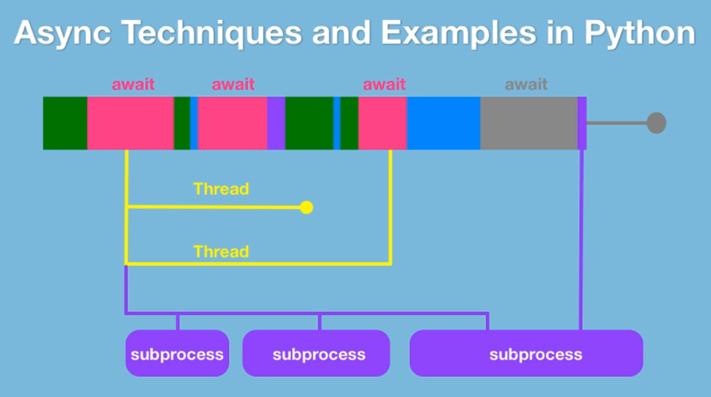

- [AsyncIO](#asyncio)
  - [Anatomy](#anatomy)
- [Thread](#thread)
  - [Anatomy](#anatomy-1)
  - [Lock](#lock)
- [Thread vs AsyncIO](#thread-vs-asyncio)
- [Multiprocessing](#multiprocessing)
- [Reference](#reference)

This project is to demonstrate how Python works for concurrency. The version of Python is expected to be 3.5 or above.



Python has a memory management feature called __the GIL__, or __Global Interpreter Lock__.


1. why async and when
2. async and await (asyncio)
3. multi-threaded parallelism
4. thread safety
5. multi-process parallelism
6. execution pools
7. extending async patterns
8. async web frameworks
9. parallelism in C (with Cython)


- Do more at once
  - asyncio
  - threads
- Do things faster
  - multiprocessing
  - C / Cython
- Do both easier
  - trio
  - unsync


## AsyncIO
Cooperative Concurrency or Parallelism

### Anatomy
Async method:
- Begin by making method `async`
- `await` all async methods called

```py
async def process_data(num: int, data: asyncio.Queue):
  processed = 0

  while processed < num:
    item = await data.get()
    # work with item when acquired
```

Async web request:
- Use an `async with` block to start the request
- `await` the network read operation

```py
async def get_html(url: str):
  async with aiohttp.ClientSession() as session:
    async with session.get(url) as resp:
      resp.raise_for_status()

      return await resp.text()
```


> Asynchrony,  in computer programming, refers to the occurrence of events independent of the main program flow and ways to deal with such events.
> These may be "outside" events such as the arrival of signals, or actions instigated by a program that take place concurrently with program execution, without the program blocking to wait for results.


## Thread

### Anatomy

```py
def generate_data(num: int, inputs: list):
  ...

# create the thread, set thread executing at background by setting daemon to True
work = threading.Thread(target=generate_data, args=(20,[]), daemon=True)

# start the thread
work.start()

...

# ask the thread to join into current main thread, so that main thread will wait until the tread is finished
work.join()

# anything else will only continue after thread above is done
...

```

### Lock
There are multiple cases that would cause unexpected situations:
- no lock: data inconsistency
- multiple thread share two locks:
  - when one thread gets one and the other gets another, starvation would occur
  - when locks doesn't have an order to acquire, starvation would occur


## Thread vs AsyncIO
Thread and AsyncIO are both for "do more at once" while waiting on other things to be finished.

AsyncIO programming model is actually nicer and cleaner, which is basically the synchronous regular programming model with just understanding restartable coroutines.

Threaded programming, though old school, is still needed since no all libraries and systems is fittable with `async` and `await`. When speaking about the GIL, it means threads are no good for concurrency when trying to leverage CPU bound operations, since GIL will only allow the code to execute one operation at a time. One of the important caveats around that is Python will let go of GIL while it's waiting on IO operations like go over the network or talk to the file system.

All in all, AsyncIO when you can, Thread when you must.


## Multiprocessing

```py
# create a new Pool instance
pool = Pool(processes=3)

# start the work with `apply_async`
pool.apply_async(func=do_math, args(0, 100))
pool.apply_async(func=do_math, args(101, 200))
pool.apply_async(func=do_math, args(201, 200))

# must call `close` then `join`
pool.close()
pool.join()
```


## Reference
- Async Techniques and Examples in Python: https://training.talkpython.fm/courses/details/async-in-python-with-threading-and-multiprocessing
- Power and Head Problems Led to Multiple Cores and Prevent Further Improvements in Speed: https://www.slideshare.net/Funk98/end-of-moores-law-or-a-change-to-something-else
- Sample Code: https://github.com/talkpython/async-techniques-python-course
